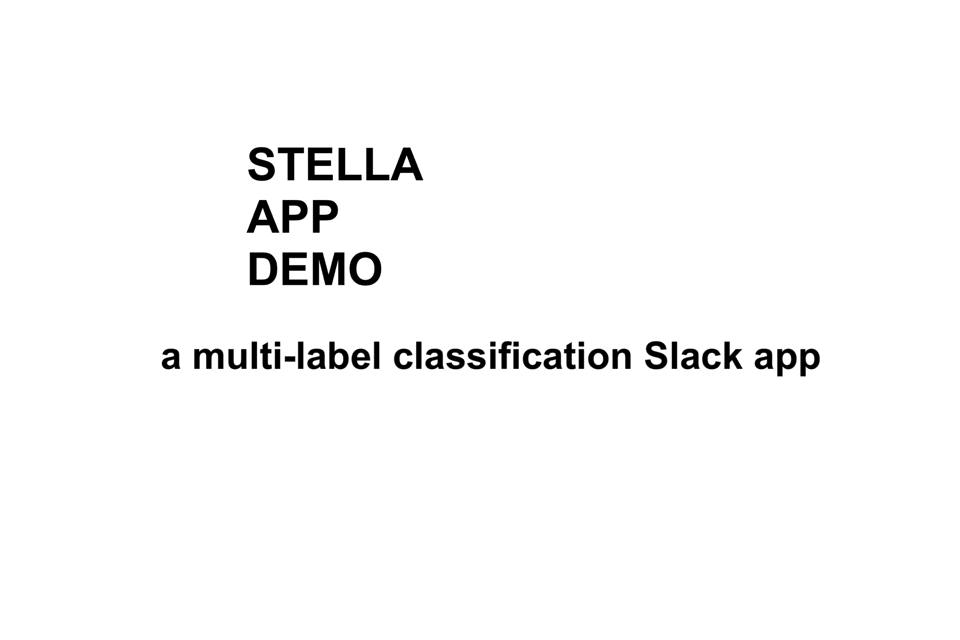

# STELLA - a multi-label classification Slack app
Working at a company with dozens of editors that published over 2k articles a month, a large pain point was having the editors “cleanly” and consistently tag their articles. Thus, the business intelligence team was always struggling to extract meaningful insights from our content with such poor metadata. For the past couple years I had been developing my machine learning skills, so I saw this problem as an excellent opportunity to build a solution using this technology. I decided to train my own NLP model that could accurately auto tag any article an editor wrote. I also needed a quick and easy way for editors to work with the auto tagger. Since Slack was already widely adopted at our company, I decided a Slack app would be a great platform to leverage in order to get immediate adoption and feedback. Enter Stella - a multi-label classification Slack app. Trained on over 20,000 fashion articles and 300 white listed tags, the machine achieved 90% accuracy when tested against the humans. Who knows, maybe it will write articles next.

## Built With

I wrote this app when I was taking the [Fast AI](https://www.fast.ai/) course on machine learning. Some of the biggest motivations to writing this script was to learn how to write NLP models using Tensorflow. Also, I used Django to quickly build an API that could manage the communications between Slack and the NLP model. I hosted the app on Heroku.

* [Tensorflow](https://www.tensorflow.org/) - An open source machine learning framework.
* [Django](https://www.djangoproject.com/) - Django is a high-level Python Web framework that encourages rapid development and clean, pragmatic design.
* [Heroku](https://www.heroku.com/) - Heroku is a platform as a service (PaaS) that enables developers to build, run, and operate applications entirely in the cloud.

## Authors

* **Justin Sullivan** - [Linkedin](https://www.linkedin.com/in/justsull)

## Acknowledgments

* Hat tip to [ml4a-guides](https://github.com/ml4a/ml4a-guides) for providing excellent IPython notebooks and tutorials on Tensorflow.
